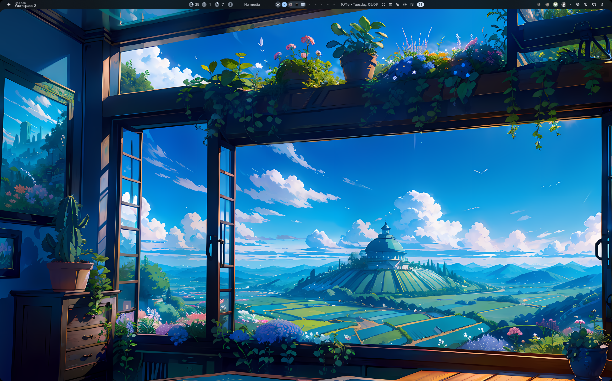
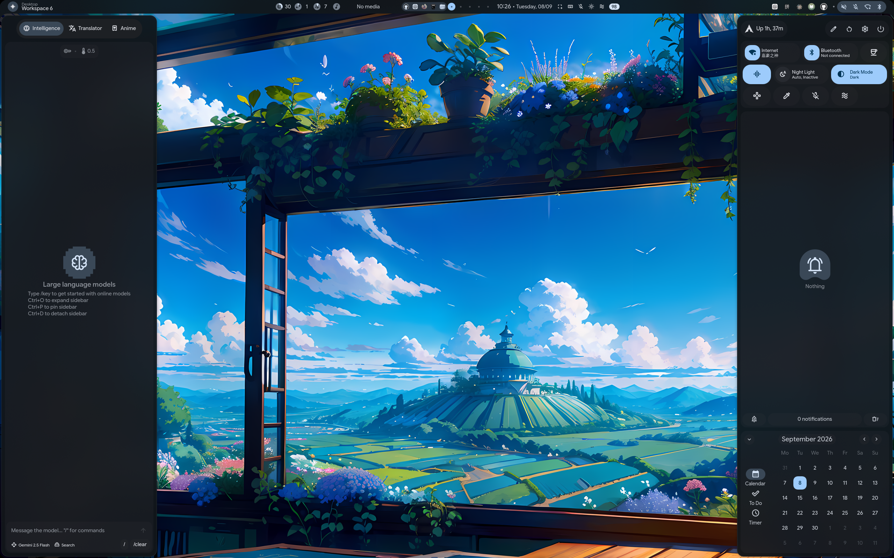
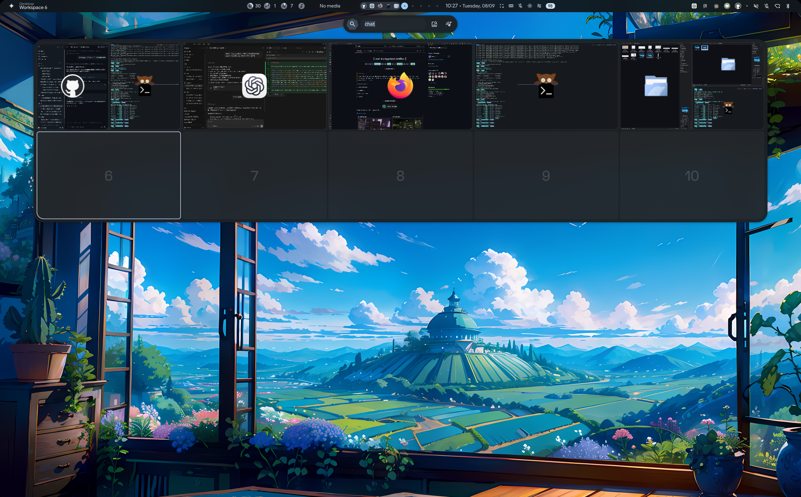
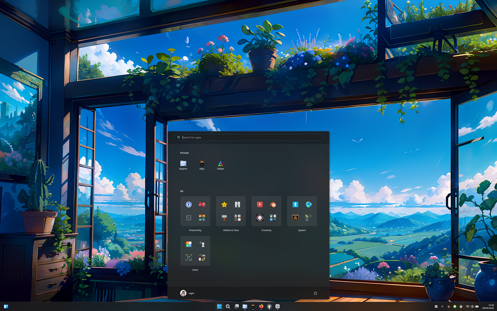
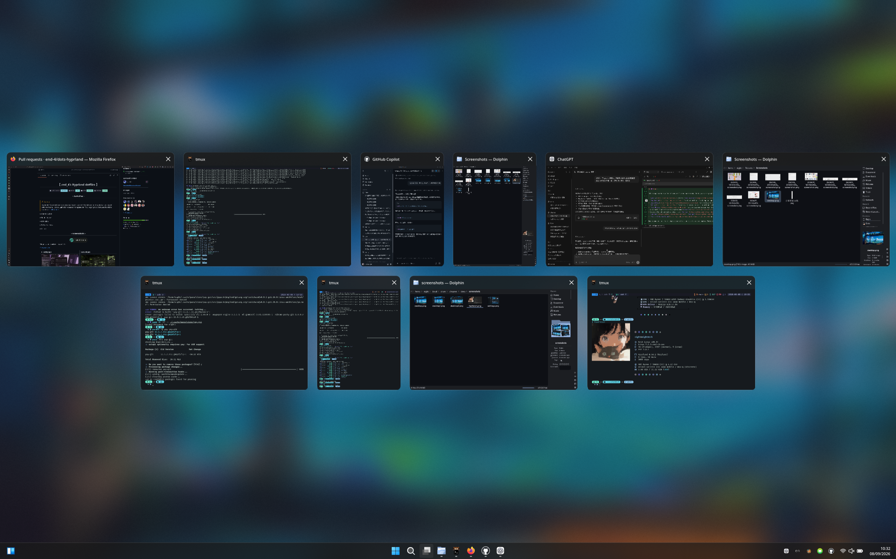
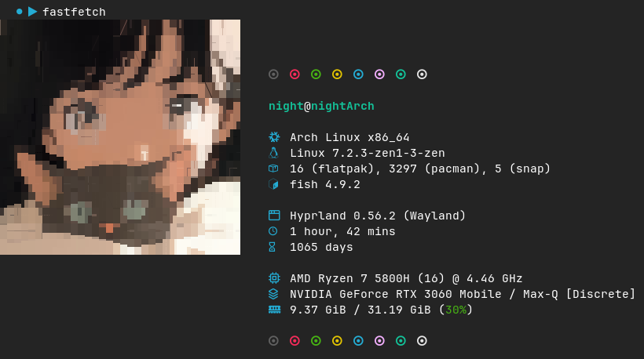
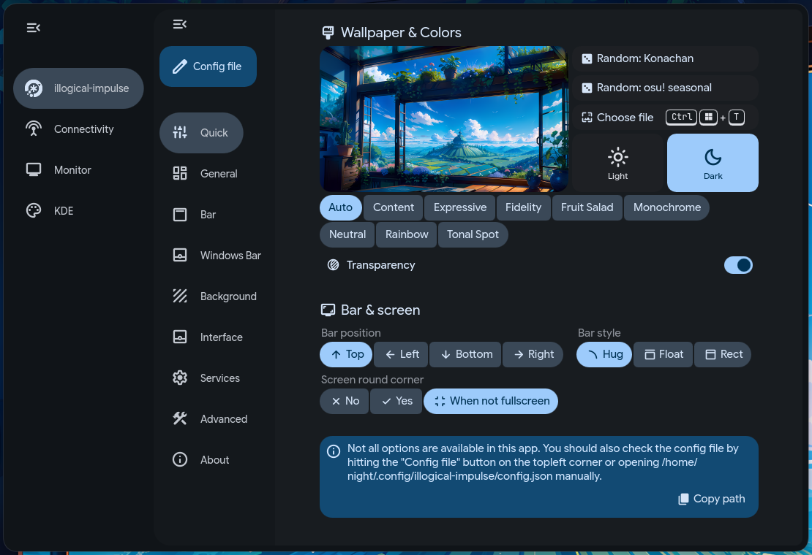

<div align="center">

# 🌌 Night's Linux Dotfiles

Personal Arch Linux configuration managed with [chezmoi](https://www.chezmoi.io/), focused on a reproducible desktop, a comfortable terminal, and a recovery path that is easy to inspect before it changes the machine.

[](https://archlinux.org/)
[](https://hyprland.org/)
[](https://www.chezmoi.io/)
[](https://github.com/TwelveNight/dotfiles/commits/main)

✨ Shell · 🪟 Hyprland · 🎨 Quickshell · 🧰 Neovim · 🖥️ Waffle bar · 🧪 Reproducible restore

</div>

## ✨ What this repository is

This is a personal, single-machine configuration snapshot. It is designed to restore the environment I use every day without silently changing the running desktop.

- 🐚 **Shell and terminal:** Zsh, Fish, Bash, Starship, Kitty, Tmux, Git, Lazygit.
- 🧑‍💻 **Editors and tools:** Neovim/LazyVim, Yazi, Code, VSCodium, IdeaVim and VsVim.
- 🪟 **Desktop:** Hyprland Lua configuration, Hypridle, Hyprlock, Fcitx5, Ghostty, Foot, WezTerm and Fastfetch.
- 🎨 **Quickshell:** a maintained local snapshot of ii/illogical-impulse with the Waffle Windows-style bar, task view, settings pages and personal integrations.
- 🔐 **Safety:** credentials, caches, plugin Git metadata and generated state stay outside normal versioned configuration.

## 🖼️ Optional screenshots

<details>
<summary>Desktop gallery</summary>









</details>

These screenshots are optional documentation assets rather than part of the restore process. Replace them when the desktop design changes, and avoid publishing notifications, private paths or credentials.

## 🧭 Restore safely

Install chezmoi, Git, Python 3.11+, Lua, and the applications needed by the profile. Then inspect the proposed result before applying it:

```sh
chezmoi init TwelveNight
cd "$(chezmoi source-path)"
python scripts/check.py --restore
chezmoi diff
```

Apply only the groups you want:

```sh
chezmoi apply ~/.zshenv ~/.config/zsh ~/.config/fish ~/.bashrc ~/.config/starship.toml
chezmoi apply ~/.config/kitty ~/.config/tmux ~/.config/git ~/.config/lazygit ~/.local/scripts
chezmoi apply ~/.config/nvim ~/.config/yazi
chezmoi apply ~/.config/hypr ~/.config/quickshell ~/.config/illogical-impulse
```

The desktop group should be applied after matching Hyprland, Quickshell, Qt6 QML modules, Matugen, Fuzzel, audio tools and input-method packages are installed. Reload the desktop only after reviewing `chezmoi diff`.

## 🪟 Waffle and Windows-style bar

The Waffle family is selected through `panelFamily` in `~/.config/illogical-impulse/config.json`. Its taskbar keeps pinned applications visible and can optionally hide windows from other workspaces. The setting is available in the ii Settings application under **Windows Bar**.

The current taskbar work includes:

- 🧩 all-workspace task view support;
- 🖱️ task previews with activation and notification actions;
- 🎛️ configurable current-workspace filtering;
- 🧭 Windows-style `Super+Tab` window preview and switching;
- 🗂️ a Waffle settings and system-settings sidebar;
- 🖥️ multi-monitor-safe panel loading.

The Waffle code is maintained as a local snapshot because the upstream desktop changes independently of this machine's chosen behavior.

## 🔍 Checks

The repository includes read-only checks and a temporary restore test:

```sh
python scripts/check.py
python scripts/check.py --restore
PYTHONDONTWRITEBYTECODE=1 python -m unittest discover -s scripts -p 'test_*.py'
```

The restore test isolates `HOME`, XDG paths, chezmoi state and caches. It performs two restores and compares content, permissions, links, syntax and key references without starting a desktop session or installing plugins.

Static checks do not replace manual verification of display layout, input methods, shortcuts, screenshots, fonts or plugin behavior.

## 🔌 Plugins and locked versions

Plugin installation is separate from configuration restoration:

- **Neovim:** keep `lazy-lock.json` and run `:Lazy restore`, not `:Lazy update`.
- **Yazi:** use the revisions in `package.toml` and avoid upgrading during restore.
- **Zap and TPM:** use the pinned origins and revisions in [`docs/plugin-sources.json`](docs/plugin-sources.json).
- **Private data:** re-enter API keys and application logins locally. Secrets files are optional, ignored and never restored from Git.

## 🔐 Secrets and machine-specific state

Zsh secrets belong in `~/.config/zsh/utils/secrets.zsh` with mode `600`; Fish secrets can live in `~/.config/fish/conf.d/secrets.fish`. Personal wallpaper files, fonts, Rime learning data, application tokens, caches and generated themes are intentionally outside the normal restore set.

If a secret was ever committed accidentally, rotate it. This repository does not rewrite history automatically.

## 🔁 Daily maintenance

Sync one related file at a time, inspect the diff, and test before committing:

```sh
chezmoi add ~/.config/tmux/tmux.conf
cd "$(chezmoi source-path)"
git diff --stat
git diff -- private_dot_config/tmux/tmux.conf
python scripts/check.py --restore
```

When changing the repository directly, use a targeted deployment:

```sh
chezmoi diff ~/.config/quickshell/ii/settings.qml
chezmoi apply ~/.config/quickshell/ii/settings.qml
```

Plugin upgrades, desktop reloads and configuration changes are separate operations. Before a larger change, keep a backup of the affected target files and use `git show <commit>:<file>` as a rollback reference.

## 📚 Documentation

- [Maintenance guide](docs/maintenance.md)
- [Quickshell maintenance notes](docs/quickshell-maintenance.md)
- [Plugin sources and pinned revisions](docs/plugin-sources.json)
- [Software version baseline](docs/software-versions.txt)
- [Neovim notes](private_dot_config/nvim/README.md)

## 💜 Thanks

This setup stands on a lot of thoughtful open-source work. Thank you to the people and projects that make it possible to build, learn and tinker:

- [@end-4](https://github.com/end-4) and the [dots-hyprland](https://github.com/end-4/dots-hyprland) contributors for the ii/illogical-impulse foundation and its desktop ideas.
- [@outfoxxed](https://github.com/outfoxxed) for Quickshell and for being so supportive of the Quickshell ecosystem.
- [Quickshell](https://github.com/quickshell-mirror/quickshell) for the Wayland shell framework behind the desktop UI.
- [@clsty](https://github.com/clsty) for making the dots easier to install and maintain.
- [@midn8hustlr](https://github.com/midn8hustlr) for the color-generation work that inspired parts of the theming flow.
- Quickshell inspiration and examples from [Soramane](https://github.com/caelestia-dots/shell/), [FridayFaerie](https://github.com/FridayFaerie/quickshell) and [nydragon](https://github.com/nydragon/nysh).
- Earlier EWW and desktop-bar ideas from [@fufexan](https://github.com/fufexan/dotfiles), which helped shape the Waffle Windows-style bar.
- [Hyprland](https://github.com/hyprwm/Hyprland), [Matugen](https://github.com/InioX/matugen), [chezmoi](https://github.com/twpayne/chezmoi), [Neovim](https://github.com/neovim/neovim), [LazyVim](https://github.com/LazyVim/LazyVim) and [Yazi](https://github.com/sxyazi/yazi).
- [Fluent UI System Icons](https://github.com/microsoft/fluentui-system-icons) and [Material Symbols](https://github.com/google/material-design-icons) for the icon language used throughout the shell.

Some components are local adaptations rather than direct upstream copies. Their original licenses and source notes remain with the relevant files.

<div align="center">

Made for a calm, inspectable Linux setup. 🌙

</div>
