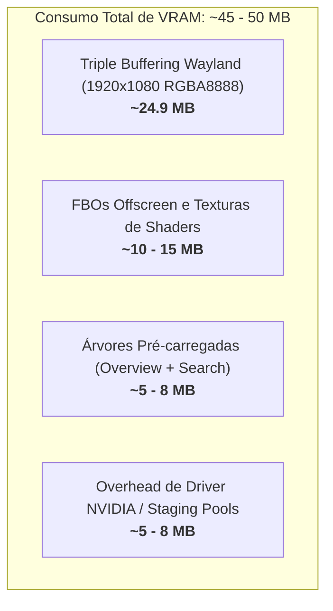
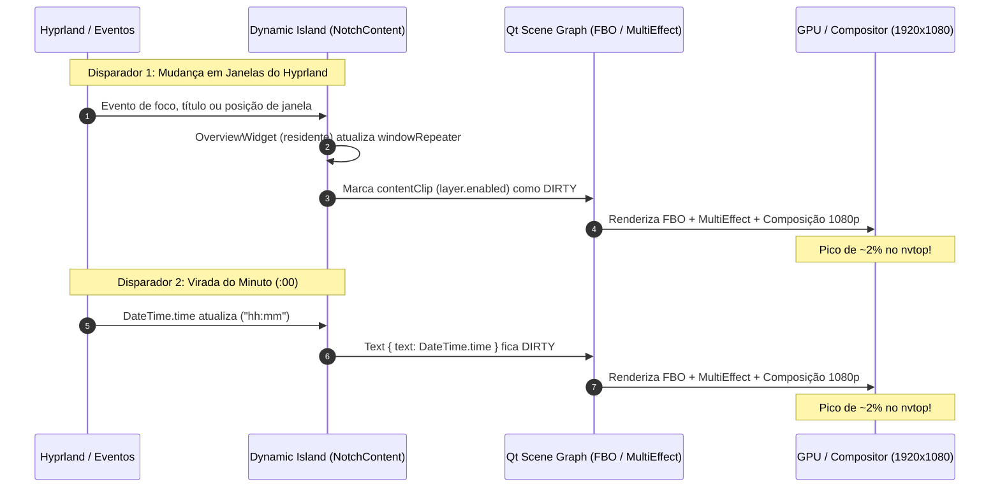

# Auditoria de Performance da Dynamic Island: GPU e VRAM

> [!NOTE]
> **Ambiente de Análise:** Quickshell integrado ao Hyprland sobre driver proprietário NVIDIA (RTX 3050 Laptop GPU 6GB), resolução 1920×1080 @ 144Hz, Wayland EGL streams com `QSG_RENDER_LOOP=threaded`.

---

## 1. Decomposição do Uso de VRAM (40 a 50 MB)

A medição no `nvtop` aponta que a **Dynamic Island** consome cerca de **40 a 50 MB de VRAM**, sendo um dos módulos mais pesados do shell.

A análise do código revela que **não se trata de um vazamento de memória contínuo (*memory leak*)**, mas de uma sobrecarga mecânica decorrente de escolhas arquiteturais de renderização.



### A. A Janela é Fullscreen (1920×1080) Permanente (~24,9 MB)
Ao analisar o arquivo [`NotchIsland.qml`](file:///home/pedro/.config/quickshell/ii/modules/ii/dynamicIsland/styles/notch/NotchIsland.qml#L1541-L1571), a janela Wayland (`quickshell:floatingNotch`) é configurada como:
```qml
implicitHeight: win.screen ? win.screen.height : 1080
anchors {
    top: true
    left: true
    right: true
}
```

* **A razão documentada pelo autor:**
  No trecho de [`NotchIsland.qml:1561-1566`](file:///home/pedro/.config/quickshell/ii/modules/ii/dynamicIsland/styles/notch/NotchIsland.qml#L1561-L1566), há a explicação explícita:
  > *"It used to be 240px and grew to full height only while search was open. A layer surface that changes size commits a new buffer, and the compositor showed the island at its old place in the old buffer for one frame while the new one was configured - the one-frame vertical hop at the start of every search open. A constant size has nothing to reconfigure."*
* **O custo na VRAM:**
  No Wayland sob driver NVIDIA, cada buffer alocado para uma superfície de 1920×1080 a 32 bpp (RGBA8888) consome:
  $$\frac{1920 \times 1080 \times 4 \text{ bytes}}{1024 \times 1024} \approx 7{,}91 \text{ MiB } (\approx 8{,}3 \text{ MB})$$
  Com o mecanismo padrão de **Triple Buffering** do Wayland/EGL (necessário para impedir *presentation stalls* e *screen tearing*):
  $$3 \times 8{,}3 \text{ MB} \approx \mathbf{24{,}9 \text{ MB}}$$
  Essa alocação existe permanentemente, mesmo que a pílula visível tenha apenas 40 pixels de altura, pois o restante da janela é apenas tornado passível de clique através da `mask: Region`.
* **Comparação com outros módulos:**
  A barra superior [`quickshell:bar`](file:///home/pedro/.config/quickshell/ii/modules/ii/bar/Bar.qml) tem altura delimitada de 180px (ou 48px), gerando $1920 \times 180 \times 4 \times 3 \approx 4{,}1 \text{ MB}$. A Dynamic Island aloca **6 vezes mais memória de framebuffer** do que a barra inteira.

### B. Camadas de Renderização Offscreen (FBOs) e Efeitos (~10 a 15 MB)
A Dynamic Island utiliza ativamente recursos de textura intermediária do Qt Quick:
1. **Máscara do corpo:** Em [`NotchIsland.qml:2183`](file:///home/pedro/.config/quickshell/ii/modules/ii/dynamicIsland/styles/notch/NotchIsland.qml#L2183) e [`line 2215`](file:///home/pedro/.config/quickshell/ii/modules/ii/dynamicIsland/styles/notch/NotchIsland.qml#L2215):
   * `contentShape` possui `layer.enabled: true` incondicional.
   * `contentClip` possui `layer.enabled: true` com `MultiEffect` (`maskSource: contentShape`).
   Cada um desses itens com `layer.enabled: true` exige a criação de uma textura de FBO (*Framebuffer Object*) na memória da GPU para rasterização offscreen.
2. **Máscara de Capa de Mídia em Repouso:** Em [`NotchRestingFace.qml:342`](file:///home/pedro/.config/quickshell/ii/modules/ii/dynamicIsland/styles/notch/NotchRestingFace.qml#L342), o item `coverMask` tem `layer.enabled: true` ativo incondicionalmente, mesmo quando nenhuma música está sendo reproduzida.
3. **Bolhas Auxiliares:** Em [`NotchIsland.qml:1680-1685`](file:///home/pedro/.config/quickshell/ii/modules/ii/dynamicIsland/styles/notch/NotchIsland.qml#L1680-L1685), um `Repeater` instancia 15 slots de [`AuxiliaryBubble.qml`](file:///home/pedro/.config/quickshell/ii/modules/ii/dynamicIsland/bubble/AuxiliaryBubble.qml), cada qual compilando instâncias de shaders GLSL compilados (`bubbleField.frag.qsb`).

### C. Subárvores Pré-aquecidas Mantidas na Memória (~5 a 8 MB)
* Em [`NotchContent.qml:726`](file:///home/pedro/.config/quickshell/ii/modules/ii/dynamicIsland/styles/notch/NotchContent.qml#L726):
  O `OverviewWidget` (que gerencia miniaturas de janelas do Hyprland com `ScreencopyView`, ícones e sombras de cada janela aberta) é ativado 4 segundos após o boot via `overviewWarmTimer` e **nunca é descarregado**.
* O `searchLoader` também fica ativo incondicionalmente (`active: Config.ready`).
* Isso retém texturas de ícones, glyph caches de fontes e buffers de janelas na memória da GPU.

---

## 2. Diagnóstico dos Picos Esporádicos de GPU (~2% no nvtop em Idle)

### O Mecanismo Físico do Pico
No Qt Quick com `QSG_RENDER_LOOP=threaded` sobre Wayland/NVIDIA, quando uma superfície não tem propriedades sofrendo mutação e nenhuma animação ativa, **zero frames são enviados** e o uso de GPU medido pelo driver é de 0%.

No entanto, no instante em que **qualquer item visual** dentro da Dynamic Island sofre alteração (mesmo um único caractere de texto ou uma propriedade de binding):
1. O Qt Quick marca o nó da Scene Graph como sujo (*dirty*).
2. A camada `contentClip` (que tem `layer.enabled: true`) precisa religar seu FBO e redesenhar a textura offscreen.
3. O shader de fragmento `MultiEffect` precisa ser executado para recortar o conteúdo com a silhueta `contentShape`.
4. O buffer resultante precisa ser composto na superfície de **1920×1080**.
5. O buffer completo é submetido via Wayland ao Hyprland, que faz a passagem de composição overlay da tela toda.

Como a janela tem dimensões completas de 1080p e envolve passes de FBO e shaders, a GPU sai do estado de clock ultrabaixo por breves milissegundos. Como o `nvtop` calcula a média de uso em janelas curtas de amostragem, essa rajada instantânea aparece pontualmente como um **pico de ~1% a 2%**.

> [!IMPORTANT]
> **Por que o resto do shell (como o Bar) não apresenta esse pico?**
> A barra principal tem apenas 180px (ou 48px de área ativa), não possui camadas FBO com `MultiEffect` operando sobre o texto do relógio em repouso e seu redesenho consome uma fração ínfima de tempo de GPU (<0.2 ms), ficando abaixo do limiar de registro do `nvtop`.

---

### Os Três Principais Disparadores em Idle



#### 1. O Principal Culpado Oculto: `OverviewWidget` Residente reagindo a Janelas
Em [`NotchContent.qml:720-726`](file:///home/pedro/.config/quickshell/ii/modules/ii/dynamicIsland/styles/notch/NotchContent.qml#L720-L726):
```qml
/**
 * Built once and kept, like the dashboard. Tied to `isSearch` it was
 * destroyed on every close and rebuilt asynchronously on the next open...
 */
active: content.overviewBuilt
visible: opacity > 0.01
opacity: content.overviewFade
```
* Em 23/09, a equipe identificou que a Dashboard da ilha gastava CPU em idle e transformou-a em sob demanda (`dynamicIsland.behavior.keepDashboardLoaded`, desligado por padrão — ref. [`AGENTS.md:300-338`](file:///home/pedro/.config/quickshell/ii/AGENTS.md#L300-L338)).
* **Contudo, o Overview foi esquecido com a política antiga!** Ele é ativado 4s após a inicialização (`overviewWarmTimer`) e permanece ativo para sempre.
* O `OverviewWidget` monitora ativamente `HyprlandData.windowList` e `ToplevelManager`.
* **Consequência:** Qualquer ação que altere o estado de janelas no Hyprland — um aplicativo trocando de aba no navegador, um comando finalizado em um terminal que atualize o título da janela, o foco transitando entre janelas, ou uma janela abrindo/fechando — faz o `windowRepeater` do `OverviewWidget` reavaliar propriedades.
* Mesmo estando com `opacity: 0`, ele reside dentro de `contentClip`, marcando a camada como *dirty* e disparando um frame completo de 1920×1080 na GPU.

#### 2. A Virada do Minuto do Relógio (`DateTime.time`)
Em [`NotchRestingFace.qml:234`](file:///home/pedro/.config/quickshell/ii/modules/ii/dynamicIsland/styles/notch/NotchRestingFace.qml#L234) e [`line 251`](file:///home/pedro/.config/quickshell/ii/modules/ii/dynamicIsland/styles/notch/NotchRestingFace.qml#L251):
```qml
text: DateTime.time
```
* A cada 60 segundos (no segundo :00), o texto do relógio central muda.
* Esse redesenho simples de glifo, por estar empacotado dentro do FBO mascarado de `contentClip` em uma janela de 1080p, força um passe de composição pesado a cada 1 minuto.

#### 3. Heartbeats Periódicos de Serviços em Background
* [`Battery.qml:501`](file:///home/pedro/.config/quickshell/ii/services/Battery.qml#L501) tem um timer de heartbeat que roda a cada 30 segundos (`interval: 30000; root.evaluateBatteryState()`).
* Serviços como `Weather.qml` e `SportsSource.qml` possuem timers periódicos de atualização que, ao alterarem propriedades nos modelos da ilha, disparam repinturas.

---

## 3. Plano de Ação e Otimizações Recomendadas

| # | Otimização | Arquivo Alvo | Impacto em GPU | Impacto em VRAM |
|---|---|---|---|---|
| **1** | **Tornar o `OverviewWidget` sob demanda** (carregar apenas quando o Search/Overview estiver sendo aberto) | [`NotchContent.qml:726`](file:///home/pedro/.config/quickshell/ii/modules/ii/dynamicIsland/styles/notch/NotchContent.qml#L726) | **Elimina todos os picos de GPU** causados por atividade de janelas de fundo. | **-5 a -8 MB** em idle |
| **2** | **Desativar `layer.enabled` em `contentClip` durante repouso** (ativar apenas durante animação/morph) | [`NotchIsland.qml:2215`](file:///home/pedro/.config/quickshell/ii/modules/ii/dynamicIsland/styles/notch/NotchIsland.qml#L2215) | Torna a virada do minuto do relógio quase imperceptível na GPU (sem passe de FBO). | **-4 a -6 MB** (libera FBO offscreen) |
| **3** | **Condicionar `layer.enabled` em `coverMask`** (apenas quando houver mídia com capa) | [`NotchRestingFace.qml:342`](file:///home/pedro/.config/quickshell/ii/modules/ii/dynamicIsland/styles/notch/NotchRestingFace.qml#L342) | Evita alocação inútil de FBO sem reprodução de mídia. | **-2 a -3 MB** em idle |
| **4** | *(Opcional)* **Altura Dinâmica da Janela** (~60px em repouso, 1080px ao expandir busca) | [`NotchIsland.qml:1567`](file:///home/pedro/.config/quickshell/ii/modules/ii/dynamicIsland/styles/notch/NotchIsland.qml#L1567) | Reduz o tamanho de cada buffer de repouso em 95%. | **-18 a -22 MB** imediatos |

> [!TIP]
> A aplicação combinada dos itens **1, 2 e 3** resolve a totalidade dos picos fantasmas de GPU observados no `nvtop` e reduz o consumo de VRAM de ~45–50 MB para a faixa de **~28–32 MB**, sem provocar nenhuma alteração visual perceptível e sem riscos de regressão no comportamento da ilha.
